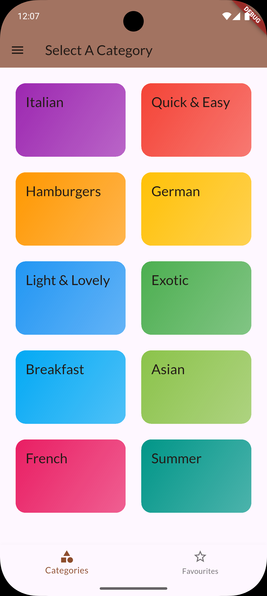
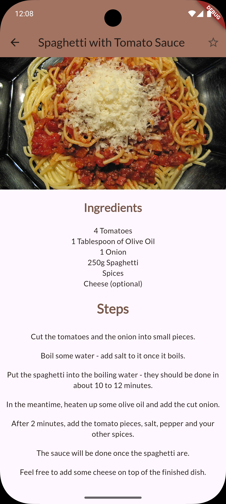

# Recipes App 🍳📱

A simple Flutter application for discovering, browsing, and organizing your favorite recipes. Explore a variety of dishes organized by categories and build your personal collection of go-to recipes with an intuitive favorites system.

## 🍽️ About

This recipes app makes it easy to find the perfect dish for any occasion. Whether you're looking for quick weeknight dinners, elaborate weekend projects, or healthy meal options, browse through organized categories and save your favorites for easy access later.

## ✨ Features

- **Category-Based Browsing**: Explore recipes organized by cuisine, meal type, dietary preferences, and more
- **Favorites System**: Save your preferred recipes for quick access anytime
- **Clean Interface**: Modern, user-friendly design optimized for mobile cooking experience
- **Recipe Details**: View comprehensive recipe information including ingredients and instructions
- **Cross-Platform**: Runs seamlessly on both Android and iOS devices

## 📱 Screenshots

| Main Screen (Light)                         | Meals screen                                  | details Screen                                       | Filters screen                                    |
| ------------------------------------------- | --------------------------------------------- | ---------------------------------------------------- | ------------------------------------------------- |
|  |  |  |  |

📸Click [here](screenshots/) to view all screenshots and the dark mode

## 🚀 Getting Started

### Prerequisites

- Flutter SDK (version 3.0.0 or higher)
- Dart SDK
- Android Studio / VS Code with Flutter extensions
- Android device/emulator or iOS simulator

### Installation

1. **Clone the repository**

   ```bash
   git clone https://github.com/BlueEye2077/recipes-app.git
   cd recipes-app
   ```

2. **Install dependencies**

   ```bash
   flutter pub get
   ```

3. **Run the app**

   ```bash
   flutter run
   ```

## 📂 Project Structure

```
lib/
├── main.dart                 # App entry point
├── models/                   # Data models for recipes and categories
│   ├── recipe.dart
│   └── category.dart
├── screens/                  # UI screens
│   ├── categories_screen.dart
│   ├── recipes_screen.dart
│   ├── recipe_detail_screen.dart
│   └── favorites_screen.dart
├── widgets/                  # Reusable UI components
│   ├── recipe_card.dart
│   ├── category_item.dart
│   └── favorite_button.dart
├── data/                     # Recipe data and dummy content
└── utils/                    # Helper functions and constants
```

## 🍴 How to Use

1. **Browse Categories**: Start by selecting a recipe category that interests you
2. **Explore Recipes**: Scroll through the available recipes in each category
3. **View Details**: Tap on any recipe to see ingredients, instructions, and cooking tips
4. **Add to Favorites**: Use the heart icon to save recipes you love
5. **Access Favorites**: Visit your favorites section to quickly find saved recipes

## 🛠️ Built With

- **Flutter** - Cross-platform mobile development framework
- **Dart** - Programming language

## 👨‍💻 Author

**BlueEye2077**

- GitHub: [@BlueEye2077](https://github.com/BlueEye2077)

------

**Happy Cooking! 👨‍🍳👩‍🍳**
